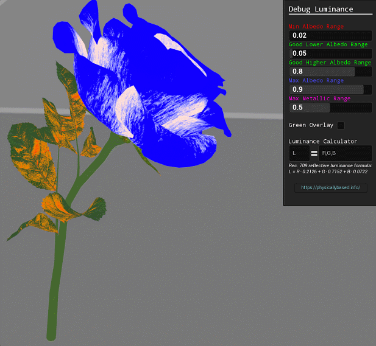
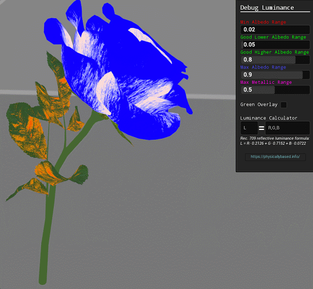
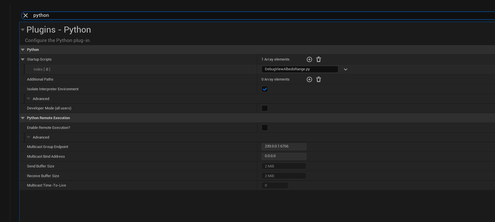
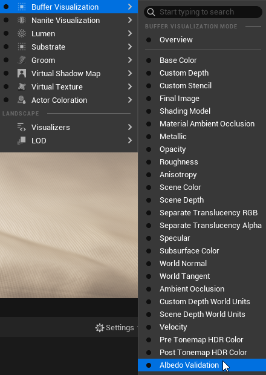
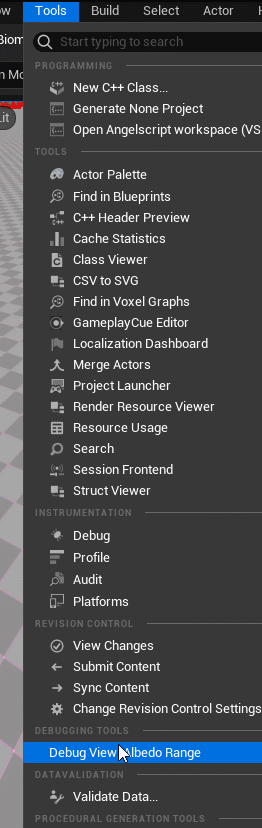

# Luminance Reflectance Debug View - Python EUW
### UE 5.7

A custom debug view that highlights physically implausible luminance and reflectance values, so you can spot assets that break energy conservation or stray from reference values. Useful when you need consistent colour accuracy across a project.




## Install
1. Copy `BufferVisualization` into your project's `Content` folder, and `Python/DebugViewAlbedoRange.py` into `Content/Python`. The script looks for both of these paths, so keep the names as they are.
2. In **Project Settings > Plugins > Python**, add `DebugViewAlbedoRange.py` as a startup script.



3. Add these two lines to `DefaultEngine.ini` in your project's `Config` folder:
```
[Engine.BufferVisualizationMaterials]

AlbedoValidation=(Material="/Game/BufferVisualization/M_AlbedoValidation.M_AlbedoValidation", Name=LOCTEXT("M_AlbedoValidationMat", "Albedo Validation"))
```
4. Restart the editor.

## Usage
1. Switch the viewport to **Buffer Visualization > Albedo Validation**.



2. Open the settings widget from **Tools > Debugging > Debug View: Albedo Range**. Close it from the same menu.



The widget drives the valid range through the `MPC_AlbedoValidation` parameter collection, so changes show up in the viewport straight away.
