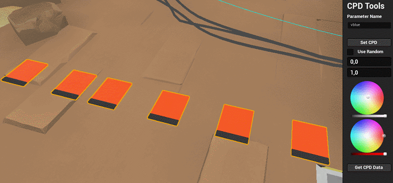
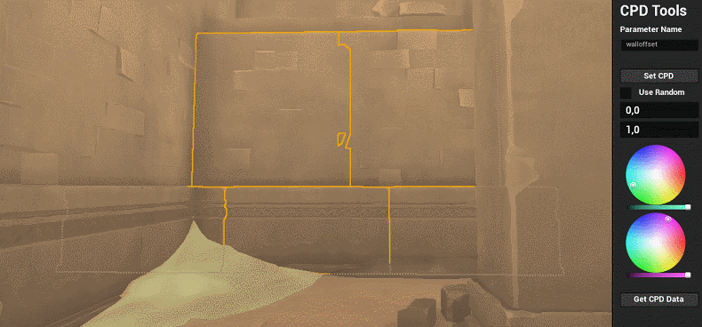
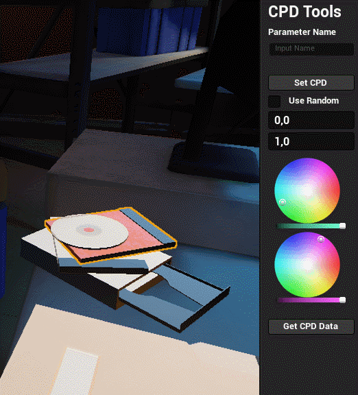

# Custom Primitive Data Widget - EUW
### UE 5

An Editor Utility Widget that batch-sets Custom Primitive Data across many actors and components. Handy for driving per-object material parameters such as tint, dirt amount or wear.

The widget includes colour pickers, so you can set a CPD colour by eye instead of typing values, and read back what is already on a selection.

## Install
Copy the contents of this folder into your project's `Content` directory.

## Usage
1. Open `EUW_CPDWidget` from the Content Browser, by right-clicking it and choosing **Run Editor Utility Widget**.
2. Select the target actors or mesh components in the level.
3. Enter the parameter name. It must match the CPD index or name your material reads.
4. Set a value, or tick **Use Random** and give it a range, then press **Set CPD**.
5. **Get CPD Data** reads back the values already on the selection.
