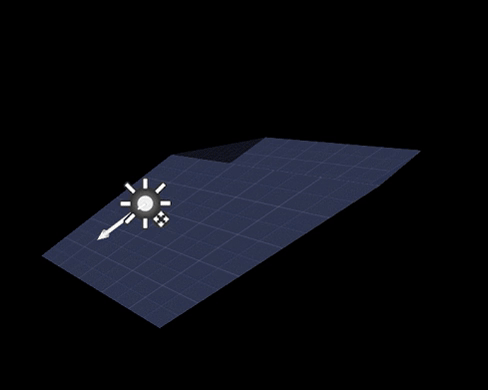
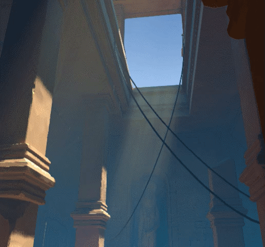
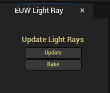

# Light Ray Tool - Geometry Script / EUW
### UE 5

A dynamic-mesh ray-shaft generator driven by a directional light. It uses distance, Fresnel and, on PC, Distance Fields for believable fading, so the result avoids obvious planes and clipping. Originally built for low-end VR (Quest 2), but it also complements volumetric fog on PC.

**This tool requires the Unreal [Geometry Script](https://dev.epicgames.com/documentation/en-us/unreal-engine/geometry-scripting-users-guide-in-unreal-engine) plugin to be enabled in your project.**

## Install
Copy the contents of this folder into your project's `Content` directory, and enable the Geometry Script plugin.

## Usage
1. Give your sun light (directional or spot) an actor tag. The tool looks for `sun` by default.
2. Place `BP_LightRay` in the level, and adjust **Width**, **Depth** and **Rotation** through the exposed parameters. The actor's own rotation and scale are intentionally locked, so use the parameters instead.

3. Open the `EUW_LightRay` panel and use:
   - **Bake** - generates static meshes and hides the dynamic actor.
   - **Update** - deletes the baked meshes and unhides the dynamic actor.

