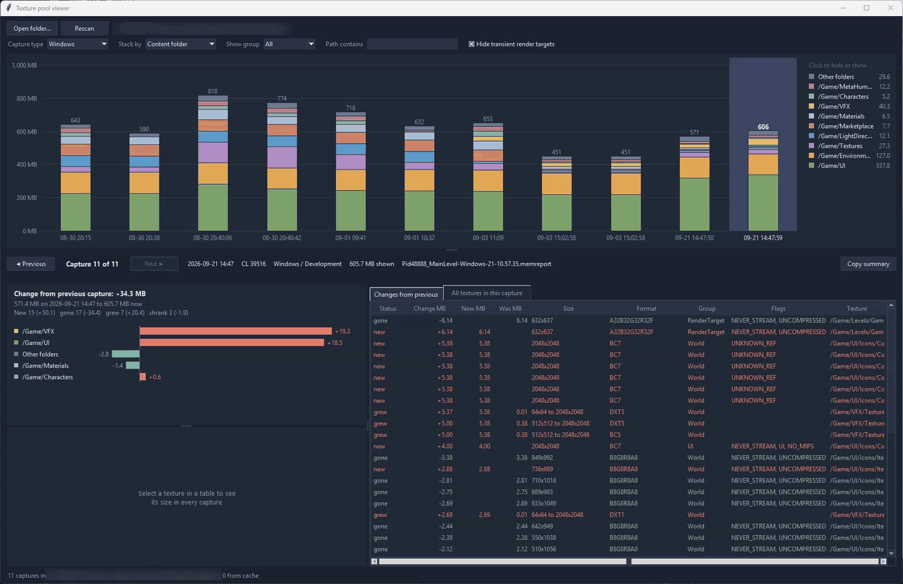

# Memreport Viewer - Texture Pool
### UE 5

A desktop viewer for Unreal Engine `memreport -full` captures. It finds every memreport in a folder, charts resident texture memory for each capture, and lets you step between captures to see which textures were added, removed, grew or shrank since the previous one.

Use it to answer "why did the texture pool grow?" without reading memreport text files by hand.



## Requirements
- Python 3.10 or newer, with tkinter. The python.org Windows installer includes tkinter by default.
- No other packages.

## Install
Copy `poolview.bat`, `poolview.py` and `pooldump.py` into the same folder. The easiest place is your project's `Saved/Profiling/MemReports` folder, because the viewer scans the folder it is in.

## Capturing memreports
1. Run your game or PIE session.
2. Open the console and run `memreport -full`.
3. The report is written to `Saved/Profiling/MemReports`.

Take one capture before and one after the change you want to measure.

## Usage
Double-click `poolview.bat`. It opens the viewer on the folder it is in.

To view a different folder, click **Open folder…** in the viewer, or pass the folder on the command line:
```
python poolview.py D:\MyProject\Saved\Profiling\MemReports
```
