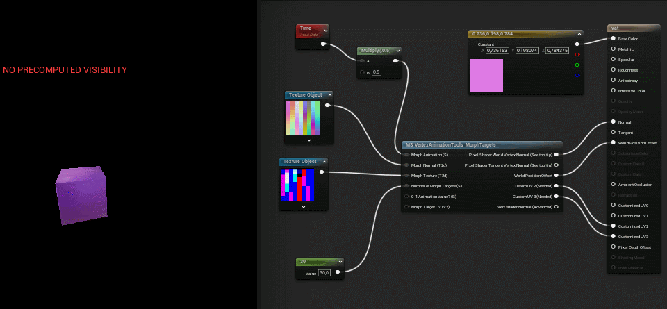

# VAT Import Setting Script - SAA
### UE 5

A scripted asset action that applies the import settings Vertex Animation Textures need, so you don't have to configure every texture and mesh by hand.

- Applies consistent Unreal import settings, known to work with standard VAT materials.
- Includes a simple VAT material so you can check playback quickly.

Pair this with assets exported from my [Blender VAT Tools](https://github.com/Real-MrBeam/b3d_tools).

## Install
Copy the contents of this folder into your project's `Content` directory.

## Usage
1. Import your VAT textures and mesh.
2. Select them in the Content Browser.
3. Right-click and run `SAA_VATSettings` from **Scripted Asset Actions**.

The correct import settings are applied for you. If you would rather set them by hand, the official documentation lists what VAT expects: [Unreal Docs](https://dev.epicgames.com/documentation/en-us/unreal-engine/vertex-animation-tool-in-unreal-engine).
