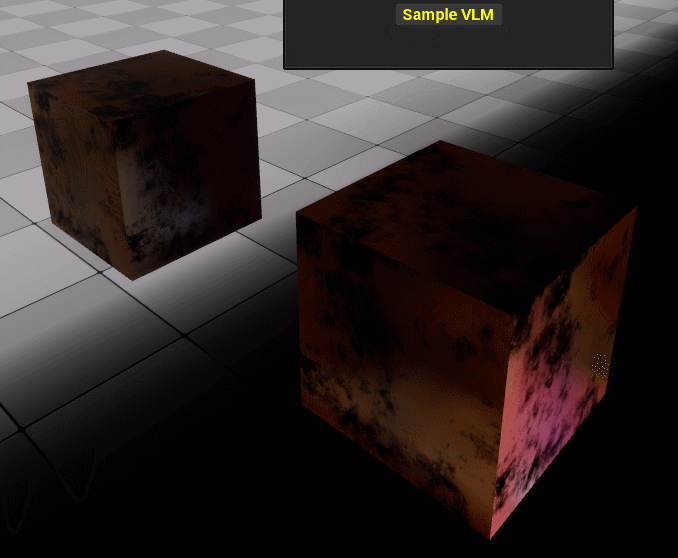

# Volumetric Lightmap Sampler - EUW
### UE 5

An Editor Utility Widget that samples the Volumetric Lightmap (VLM) at each selected actor's position and writes the result into Custom Primitive Data on its Static Mesh Components.

This is handy for tricks like fake reflections on fully rough materials, where you scale reflection strength by the local light level. It was built for low-end VR, where real reflections are too expensive.

## Install
Copy the contents of this folder into your project's `Content` directory.

## Usage
1. Build lighting, so the level has valid VLM data to sample.
2. Select the actors you want to sample.
3. Open `EUW_VLMCapturer` from the Content Browser, by right-clicking it and choosing **Run Editor Utility Widget**, then run the sampler.
4. The sampled value is written to a CPD parameter on each component.
5. In your material, read that CPD parameter to modulate reflection strength.

You can try it with this simple [material](https://blueprintue.com/blueprint/24t7k-e6/).

**Without valid VLM data in the level there is nothing to sample, so build lighting first.**
